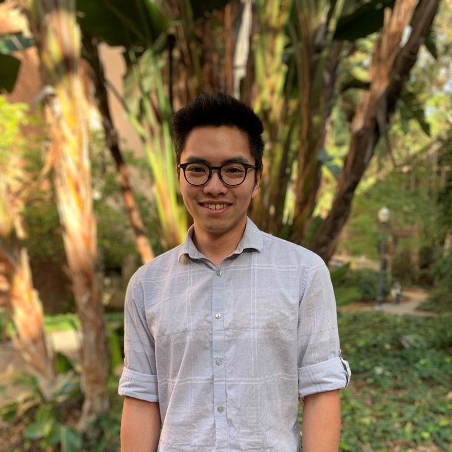



	

Hi! I'm currently a fourth year undergraduate student at UCLA studying mathematics of computation and statistics. 
I'm interested in all things machine learning, with the bulk of my experience being in statistical inference and matrix/tensor 
factorization. I also love working with data and the ways it can be used to tell stories and inform decisions.
